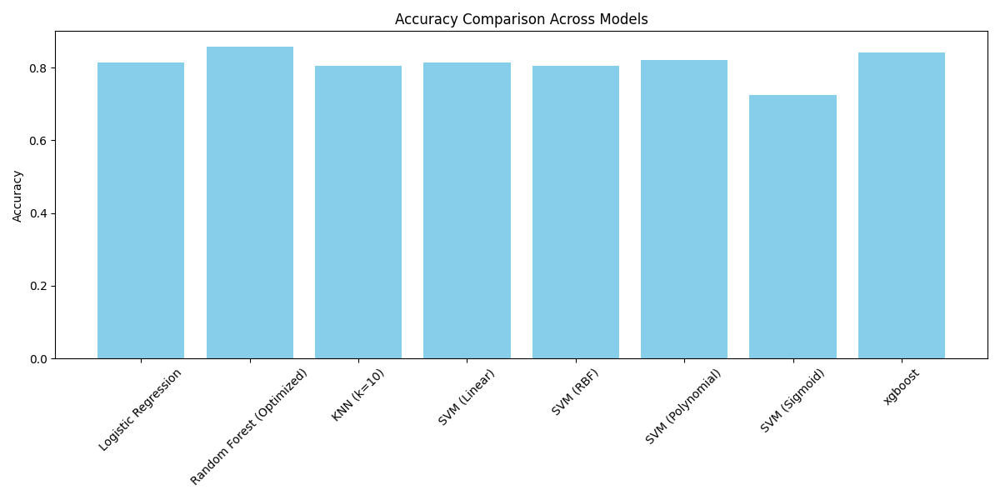

# 💼 Customer Churn Prediction Project

در این پروژه تلاش شده است با استفاده از داده‌های مشتریان شرکت مخابرات، احتمال ترک مشتری (churn) در ماه آینده پیش‌بینی شود.

---

## 🧰 ابزارها و تکنولوژی‌ها

- Python
- pandas, numpy, matplotlib
- scikit-learn
- xgboost, lightgbm
- SMOTE (برای حل مشکل class imbalance)

---

## 📊 مراحل انجام پروژه

### 🔹 پیش‌پردازش داده‌ها
- تبدیل `TotalCharges` به عددی
- حذف یا جایگزینی مقادیر خالی
- دسته‌بندی ویژگی‌های عددی مانند `tenure` و `TotalCharges`

### 🔹 Feature Engineering
- ساخت ستون‌های جدید
- Label Encoding

### 🔹 مدل‌سازی با الگوریتم‌های مختلف
- Logistic Regression
- KNN
- SVM (linear, rbf, poly, sigmoid)
- Random Forest (بهینه‌سازی‌شده با GridSearchCV)
- XGBoost
- LightGBM

### 🔹 ارزیابی مدل‌ها
- Confusion Matrix
- Classification Report
- Accuracy Score
- نمودار مقایسه دقت مدل‌ها

---

## 🔍 نتایج

- بهترین مدل: (مثلاً LightGBM) با دقت XX%
- گراف مقایسه دقت مدل‌ها:  


---

## 📁 اجرا

### نصب کتابخانه‌ها:

```bash
pip install -r requirements.txt
python churn_prediction.py
